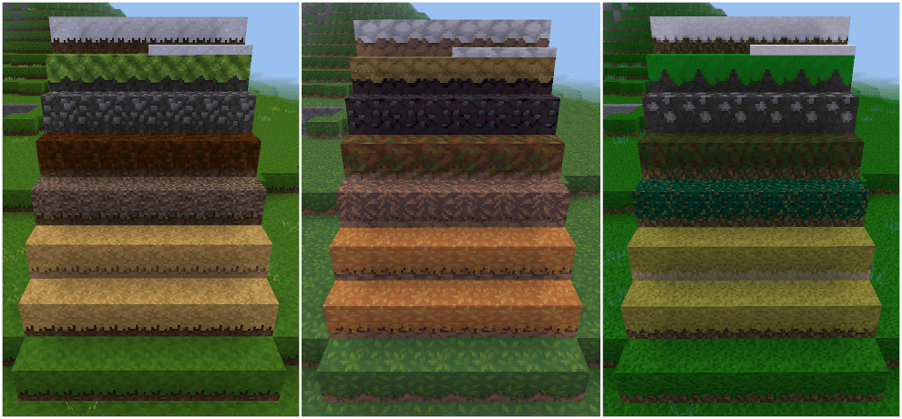

Adjusted Dirt [adjusted_dirt]
=============================

By David G (kestral246@gmail.com)

Allows adjusting the percentage of dirt showing on the sides of nodes.

**Warning:** By default this texture pack will do nothing. Read below for how to use it.

How to use
----------
I'm currently supporting three different texture packs: Minetest Game default, RPG16, and REFI Textures. I'm willing to support others, as long as they're 16px and support all the above Minetest 5.1 side nodes, which surprisingly many texture packs don't support. 

**For Minetest Game default**

- Go into the adjustable\_dirt directory.
- Copy override_def.txt to override.txt
- Delete all copies of other texture packs from this directory.
- Enable the adjustable_dirt texture pack in Minetest.

**For REFI Textures**

- Go into the adjustable\_dirt directory.
- Copy override\_refi.txt to override.txt
- Copy REFI\_Textures directory into the adjustable\_dirt directory, making sure it's the only other texture pack in this directory.
- Enable the adjustable_dirt texture pack in Minetest.

**For RPG16**

- Go into the adjustable\_dirt directory.
- Copy override\_rpg.txt to override.txt
- Copy rpg16 directory into the adjustable\_dirt directory, making sure it's the only other texture in this directory.
- Enable the adjustable_dirt texture pack in Minetest.

Each of these examples will give you a reduced amount of dirt on the sides, as shown in the above screenshot.

A simple way to change the look is to use my example files on another texture pack—use the RPG16 sides on the default textures, or vice versa. 

**However,** if you only use my examples, you're **not** taking full advantage of this texture pack. You need to customize the override.txt file to make the side textures look the way **you** want them to look.

User Customization
------------------

But to take complete control, you need to roll up your sleeves and edit you're own override.txt. For each node in this file, there are two ways to customize it: which mask to use, and the y-offset.

As an example, here are all the currently defined grass-type masks available, with an explanation of my naming scheme. *(Note that sometimes not every type of mask is used. For the default minetest textures, dry grass, coniferous litter, and rainforest litter all use the grass-type mask, but with different y-offsets.)*

**Masks**

Masks are a 16x40 png file with the top section white and the bottom section transparent, with varying transitions between these two. White corresponds to the top material texture, while transparent corresponds to the lower dirt-like texture. Names of the various masks use the following naming scheme:

**Masks - family (1-4th chars)**

- def_ = default Minetest textures
- rfi_ = REFI Textures
- rpg_ = RPG16 textures
- sto_ = Special masks just for stones textures (on permafrost)

**Masks - type (5th char)**

- c = coniferous litter
- d = dry grass
- g = grass
- m = moss
- r = rainforest litter
- s = snow

**Masks - option (6th char)**

- n = no shadow
- s = shadow
- x = special (currently only rfi uses)

**Stones option only (5th char)**

- l = left side lower
- r = right side lower
- s = straight across

**Stones option only (6th char)**

- 0 = used for straight
- 2,3 = amount left or right is lowered

**Y-offset**

Only a 16x16 section of the above masks is used. A zero y-offset corresponds to the top 16x16 pixels of the mask, and is guaranteed to be all white.

Negative y-offsets move the 16x16 box down, which reveals increasing amounts of transparent pixels, so increasing negative-y numbers correspond to raising the dirt/material transition. For the default texture grass sides:

- y-offset = 0, 100% grass/no dirt
- y-offset = -4, very narrow strip of dirt, which matches the Less Dirt texture pack by DrFrankenstone
- y-offset = -6, matches new MTG 5.1 75% grass/25% dirt
- y-offset = -10, matches older MTG 50% grass/50% dirt
- y-offset = -13, matches very old pre-2016 MTG grass coverage, which was about 25% grass/75% dirt
- y-offset = -21, no grass/100% dirt

**How to change override.txt**

Each side texture is defined by a line in the override.txt file. Here is how the dirt with grass side texture is defined. All the others are similar.

	default:dirt_with_grass sides default_grass.png^(default_dirt.png^[combine:16x16:0,-6=def_grass.png^[makealpha:255,255,255)

The important part is the "\[combine:" statement:

	…\[combine:16x16:0,-6=def_gs.png^…

The -6 is the y-offset, which can be changed, -4 would lower the transition, and -8 would raise it.

The def\_gs.png defines the mask, def\_gn.png would get rid of the shadow effect, and rpg\_gs.png would change it to the rpg16 pattern, but with shadows, which could be more appropriate when used with the default minetest textures.

**permafrost with stones**

The only exception is permafrost with stones, which looks better when masking out whole stones. I provide three simple masks, straight across transition, left side 2 pixels lower, and right side 2 pixels lower. Set the y-offset to try to line up with a gap in the stones textures that one of these patterns can match.
